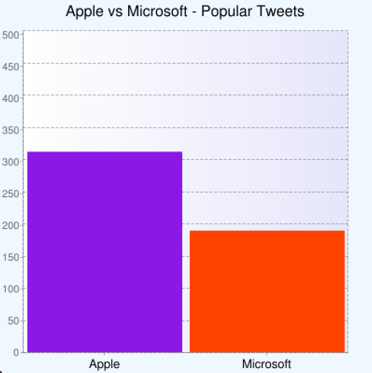

# Lever
Social Querying Language

This programming language was designed and developed as a project for the class "Programming Languages and Translators - 4115" taught by Prof. Alfred Aho in Spring 2015 at Columbia University.

The project contributors along with their respective roles are listed below:

- [Roy Hermann](https://github.com/royherma): Project Manager
- [Chaiwen Chou](https://github.com/chaiwen): Language Guru
- [Mahd Tauseef](https://github.com/mahdt): Systems Architect
- [Zissis Konstas](https://github.com/zkonstas): Systems Engineer
- [Eden Dolev](https://github.com/edolev89): Verification and Validation

## Overview

LEVER is a programming language that enables the easy retrieval, processing and displaying of information retrieved from social networks. The social network aggregation of information from multiple sources allows for:

- Easy formulation of queries that can work universally along social networks.
- Analyzing social media trends and patterns. 
- Cross-Data analysis and other various information insights.

Therefore Lever, being a simple, easy to learn programming language that can be used by business analysts and marketers, can have enormous value for organizations and individuals. Lever queries Twitter data by default.

## Installation

To compile the Lever translator navigate into the translator directory and enter the following commands:

	make antlr
	make

## Language Tutorial

To demonstrate the use, functionality and power of Lever two sample programs are presented below. Discussion and explanation for each program is also presented.

### Hello, World!

For your first Lever program, create a text file named hello.lever and add the following to the file:

	program {
		output “hello world!\n”;
	}

That’s it! When compiled and run, this will print the words “hello world” to standard output. To compile the program, open up your UNIX shell, navigate to your Lever file, and enter the command:

	./leverc hello.lever

This should compile your program and create an executable file named hello. To run the program, simply type the command:

	./lever hello

which should print to standard output:

	hello world!

All lever source files must end with “.lever” to be recognized by the compiler. Lever programs consist mainly of statements, variables, and functions that specify what commands should be executed. The first statements that are run must be within the block (within the curly braces):

	program {

	}

In our hello world program, the only statement that we have is:

	output “hello world\n”;

This calls the built in Lever command output with the argument “hello world\n”, which is a string of characters surrounded by double quotes. output will print its arguments to standard output, which in our case is “hello world\n”. The \n represents a newline character, which causes the output to advance to the next line (like hitting the return key in any text editor). Numbers may also be printed, but text should always be surrounded by double quotes. We talk more about input and output later in the tutorial.

Lastly, statements must end with a semicolon ";", which functions like a period in a sentence.

### A Simple Query

The sample program in this section illustrates one of the main use cases of our language. Getting data from a social network (Twitter) and outputting the results. The program is displayed below:
 
	program {
		var result;
		result = get #realmadrid, ["location":"barcelona"];
		output result;
	}
 
This program is similar to the previous one since it consists of the 'main' function program. However there are three statements in the block of the program. A declaration, an assignment and an output statement. We take a look at each statement individually:
 
At line 2 we have the statement: 

	var result;
 
This is a declaration of a variable. In Lever all variables must be declared before they can be used. All variables are declared by using the keyword var and then specifying the variable name (e.g. 'result'). Variables can also be initialized on the same line as a declaration. For example, we could have also written:

	var result = get #realmadrid, [“location”:”barcelona”];

The type of a variable is inferred at compile time when the variable is defined.

At line 3 we have the statement:

	result = get  #realmadrid, ["location":"barcelona"];
 
This is an assignment statement where the variable result which is the left side of the expression (left side of the ‘=’ sign) is initialized to the value of the right side of the expression. We now focus on the right side of the expression:

	get #realmadrid, ["location":"barcelona"];
 
This is a function call that returns a value. A function is called by naming it, followed by a comma separated list of arguments. In this case the function get is called with the arguments #readmadrid, ["location":"barcelona"]. get is a Lever library function that executes a query on a social network (in this version of Lever, Twitter only), given a set of query parameters.
 
There are two arguments passed to the get function. The first argument is #realmadrid. This argument is of type 'hashtag' or 'topic' and specifies that we want to filter tweets that are tagged with this hashtag. The '#' character followed by an identifier evaluates as a 'hashtag' type.
 
The second argument is ["location":"barcelona"]. This argument is of type dictionary, which is always enclosed in square brackets, and in this case functions as a filter on the results. The format of this type is a list of key:value pairs where key is the name of some filter type enclosed in double quotes followed by a colon, followed by the value for this filter, also enclosed in double quotes. In this example, only posts that originated in “barcelona” are included.
 
After the function is called the Twitter API is called behind the scenes and the query result is received. The type of the return value is "Result". This is an object type meaning that it has its own properties and methods.
 
Finally, at line 4, we use the function output to print the results. By default, results are encoded in the following format:

	@Real_Madrid_FC - Allegri: Juventus need near perfection to beat Madrid http://t.co/GrB5Z103Cc #RealMadridSun May 10 15:40:03 EDT 2015

### Built-in Graph Functionality

Lever has also a built-in graphing capability. The programmer can easily construct a visualization of the output data by using the graph library function. The graph function takes data points and generates a visual graph, either as a bar chart or line graph. It takes 4 arguments: the type of graph (“bar” or “line”), the title of the graph as a string, a list of labels for the x-axis, and a list of data points to graph. The following example creates a bar graph that shows the number of tweets related to Apple and Microsoft in May 2015:

 program {
	var result;

	result = get "apple and microsoft",["since":"2015-05-01","until":"2015-05-31"];
	output result;

	var xAxis = ["Apple", "Microsoft"];
	var counts = [2];
	counts[0] = result.tweetCount "apple";
	counts[1] = result.tweetCount "microsoft";
	 
	graph "bar", "Apple vs Microsoft - Popular Tweets", xAxis, counts;
 }

The output of the program generates the following graph.

